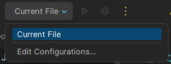
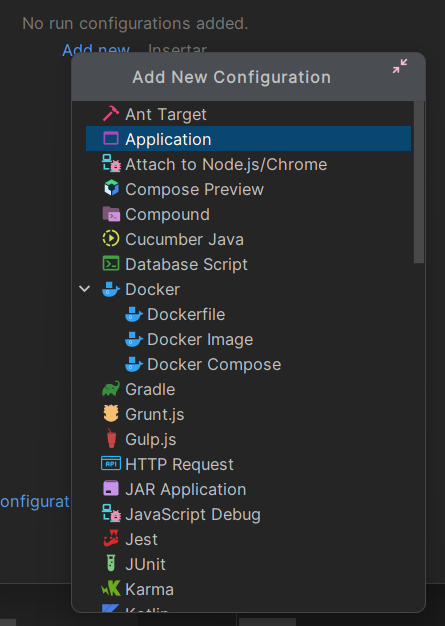
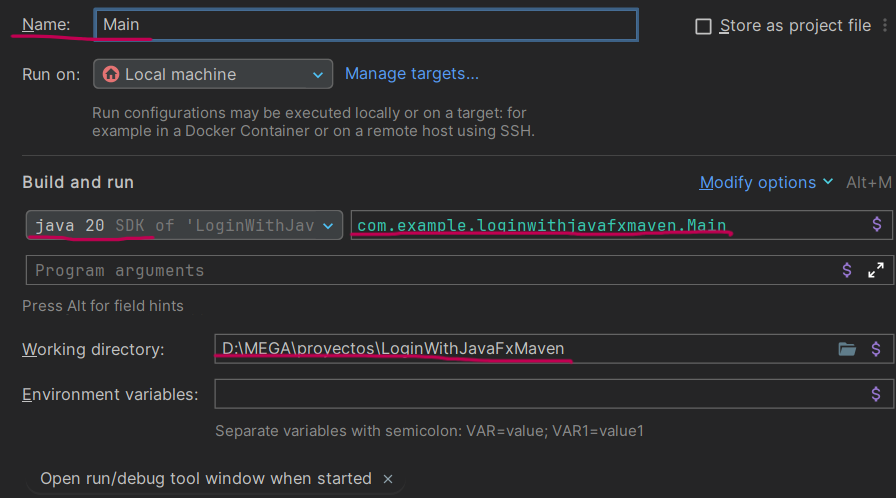

# LoginWithJava

<p align="center">
  
</p>

## Overview

LoginWithJava es una aplicación de inicio de sesión desarrollada en Java utilizando JavaFX. Proporciona una interfaz de usuario intuitiva para que los usuarios inicien sesión o creen usuarios en el sistema.

## Features

- **Inicio de sesión:** Los usuarios pueden iniciar sesión utilizando credenciales válidas almacenadas en una base de datos local.
- **Registro:** Registro de usuarios utilizando base de datos SQLite.
- **Interfaz de usuario amigable:** Diseño intuitivo y fácil de usar desarrollado con JavaFX.
- **Validación de datos:** Se implementa una validación robusta para garantizar la integridad de los datos ingresados.

## Installation

Sigue estos pasos para instalar y ejecutar el proyecto:

1. **Clonamos el proyecto**:
   ```sh
   git clone https://github.com/jbotgil/LoginWithJavaFxMaven.git
   ```
   
2. **Abrimos el proyecto en nuestro IDE de preferencia. (En mi caso INTELLIJ)**


3. **Nos dirigiremos al archivo pom.xml dentro de la carpeta raíz.**
    


4. **Ejecutaremos el pom.xml para descargar las dependencias.  
   (Este símbolo nos debe aparecer en la parte superior derecha de nuestras pantallas)**

    


5. **Una vez que se hayan descargado todas las dependencias del pom.xml, nos dirigirémos a la parte superior derecha de la pantalla y haremos clic en "Edit Configurations".**
    


6. **A continuación le daremos clic en |"Add New Configuration"| y luego seleccionaremos |"Application"|.**
    


7. **Cambiaremos el nombre de la aplicación (preferiblementa a Main), verificaremos la ruta y la versión del SDK, después añadiremos nuestra clase Main en el apartado de |"Main Class"|.**
    


8. **Una vez finalizados los pasos anteriores, solo tendremos que ejecutar nuestro Main.java utilizando la configuración de aplicación que acabamos de crear.**

<hr>

**¡Gracias por usar LoginWithJava!** Si tienes alguna pregunta o sugerencia, no dudes en abrir un issue o contactar conmigo.